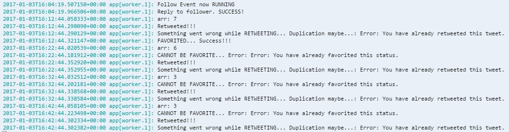

I must say this was great to do and a nice little introduction to node
and npm.


I got to doing this from finding it on [GitHub](https://github.com) I
think I was looking for the Twitter icon in bootstrap whilst working
on my
[Random Quote Generator](http://codepen.io/spences10/full/dOaYbP/) I
stumbled across the
[twitter-bot-bootstrap](https://github.com/mobeets/twitter-bot-bootstrap)
(as you do) so after stalling with my progress on the freeCodeCamp(🔥)
zipline for a Wikipedia viewer I decided to give the Twitter bot a try
and managed to create it and add it to [Heroku](https://heroku.com)
🎉"

This app didn't work as well as expected though 😦, so I then decided
to take a look at [@amanhimself](https://twitter.com/amanhimself)'s
Twitter bot he had created for the
[#100DaysOfCode](https://medium.freecodecamp.com/start-2017-with-the-100daysofcode-improved-and-updated-18ce604b237b)
challenge, which I just happen to be taking part in.

So with his great documentation
[here](https://hackernoon.com/create-a-simple-twitter-bot-with-node-js-5b14eb006c08)
and
[here](https://community.risingstack.com/how-to-make-a-twitter-bot-with-node-js/)
I managed to cobble together my own Twitter-bot which I use on my
[@spences10](https://twitter.com/spences10) Twitter account

> If you'r wondering about the post name
> [check here](https://en.wikipedia.org/wiki/RRS_Sir_David_Attenborough#Boaty_McBoatface_Naming_Controversy).

## Technologies used

Preamble out of the way, now I can walk through what was used.

### Cloud 9

I love this development environment, I soon became a fan of
[c9](https://c9.io/?redirect=0) when trying to install Ruby on my
windows machine and then again after installing Node.js on my computer
for the first time.

### Node.js

I already had this installed on my c9 environment so I just had to
`npm install --save twit` then I was up and running

### Heroku

I didn't really get what Heroku was until I started this project but
once I'd read the guides it was quite straightforward and the
[Heroku CLI](https://devcenter.heroku.com/articles/heroku-cli) was
already installed on c9 i checked with `heroku --version` before
attempting to install it.

### GitHub

You can deploy straight from your c9 environment to Heroku and there
are loads of other integration tools you can use which I haven't had
time to look into yet. It's good practice to have your code on a
repository somewhere and GitHub is widely used.

### Twitter

You will need to set up a Twitter application from the
[Twitter dev portal](https://apps.twitter.com/app/new)

---

All of the information above is in addition to the guides given by
[Aman](https://github.com/amandeepmittal) the stuff I'm going to go
through now my experience with deploying to Heroku, you may want to
host the app somewhere different.

## My Approach

Use `node bot.js` to test locally, in
[@amanhimself](https://twitter.com/amanhimself)'s example it will
tweet and favourite straight away then go on a timer.

Deploy to Heroku `git push heroku master`

This is after I have added the changes to Git with a commit message
and pushed the changes to my repo, here's the terminal commands:

```
$ git add .
$ git commit -m 'my detailed commit message'
$ git push origin master
$ git push heroku master
```

The final command will build the app on Heroku for you with output
like this:


> I know this isn't standard practice for GitHub and I am in the
> process of understanding how to branch and use Pull Requests so bear
> with me 😄

The first gotcha for me was the Heroku `Procfile` I couldn't
understand why it kept timing out, this was because it was trying to
run the default `web` process instead of the `worker` process which is
whats needed for the bot.

After getting the bare bones set up on part 1 I then got to playing
around with the timings and the query strings used by the bot, this is
where things started to go a bit
[off-piste](https://en.oxforddictionaries.com/definition/us/off-piste)



For quite a while I couldn't understand why I was getting so many
errors, with a whole lot of `console.log(var)` throughout the code I
came to the conclusion that that the query string I was using:

```
var queryString = '#100DaysOfCode, #GitHub, #VSCode';
```

You can get the logs from Heroku when you app is running by typing:

```
$ herouku logs -t
```

This will give you your logs back from Heroku so you can add all the
debug lines you want in there to determine whats going on.

I was getting the errors pictured so I started to play with the query
string and just using one value at a time which didn't cause any
errors so I decided to pass one value at a time by adding the Gist
below.

<script src="https://gist.github.com/spences10/46d9981a805786e7c965cf292b9cb3ae.js"></script>

This worked, for a while then the same errors started creeping in, I
then noticed that the `retweet` and `favoriteTweet` were on a timer
but using the same random text from the `queryString` which was about
as much use as the previous piece of code as it was a one time
initialisation [or initialization] so the same string was being used
multiple times causing the errors.

So after some head scratching and playing around with the code, [and
tweeting [@amanhimself](https://twitter.com/amanhimself) numerous
times] Aman suggested that I use the npm package
[unique-random-array](https://www.npmjs.com/package/unique-random-array)
to return a random string value from the string list.

So I added the `var` in:

```
var uniqueRandomArray = require('unique-random-array');
```

Built the query string:

```js
var queryString = uniqueRandomArray([
  '100daysofcode',
  'freecodecamp',
  'github',
  'vscode',
  'visual studio code',
  'nodejs',
  'node.js',
  'vuejs',
  'vue.js',
  'inferno_js',
  'inferno.js',
  'jekyll'
])
```

Then just replaced the `queryString` string with the `queryString()`
method.

Some other things to note that I discovered when playing around with
the bot is the `retweet` and `favoriteTweet` function `params` was the
`result_type:` options, here's my comments copy pasted from the
Twitter dev portal:

```
// result_type: options, mixed, recent, popular
// * mixed : Include both popular and real time results in the response.
// * recent : return only the most recent results in the response
// * popular : return only the most popular results in the response.
```

The next stage for this could be to use the `unique-random-array`
package to change that value too.

That's it for now, I still have a weird bug where if I follow someone
and then someone else follows me the bot decides to tweet back to
itself!


### Coming up

More stuff with the `.stream()` function, like auto follow back and
better replies.
